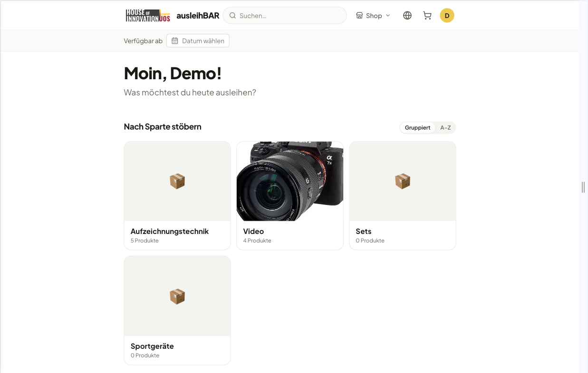
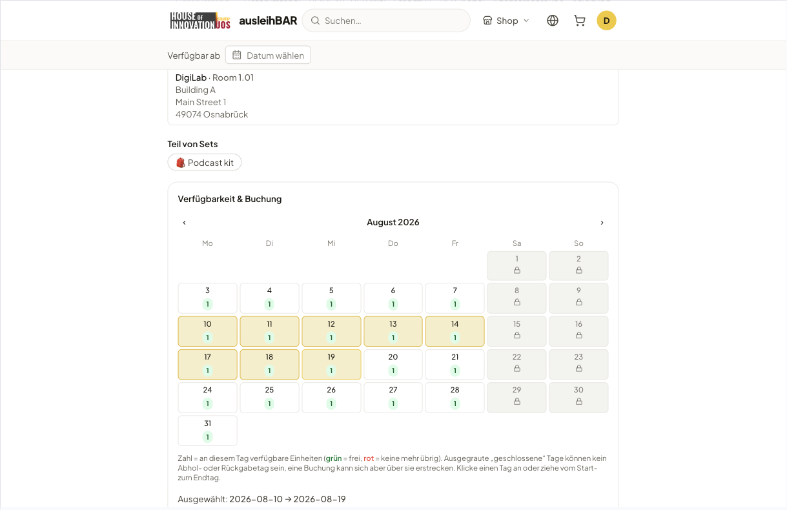
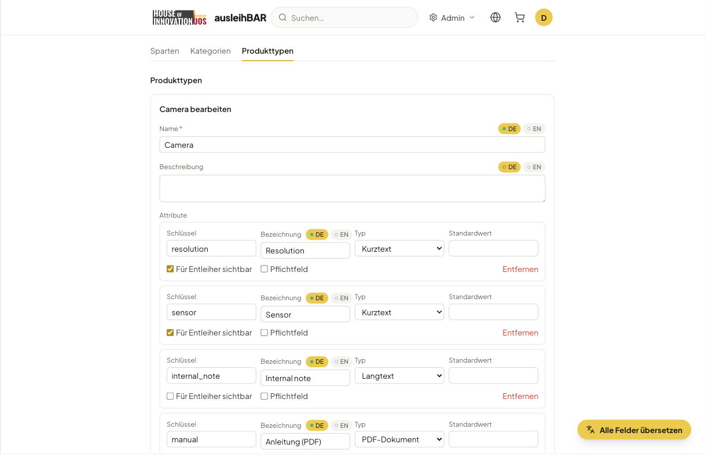
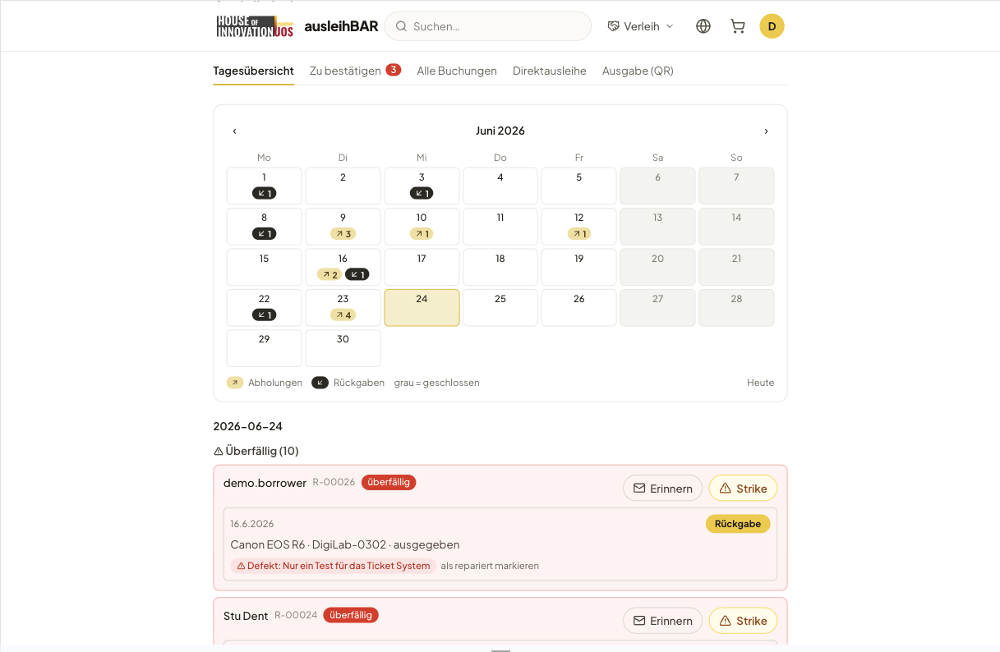
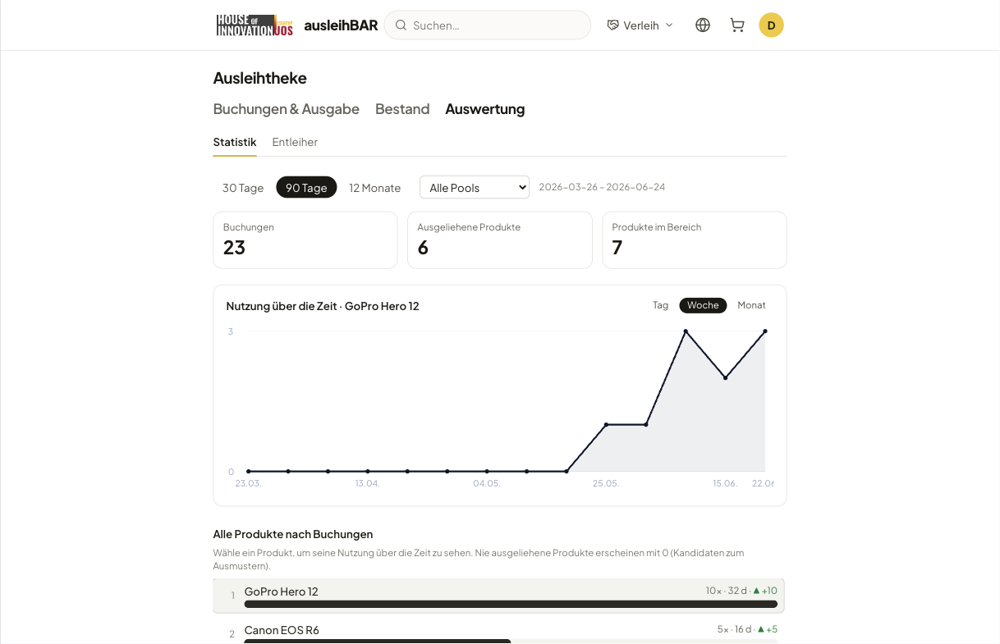
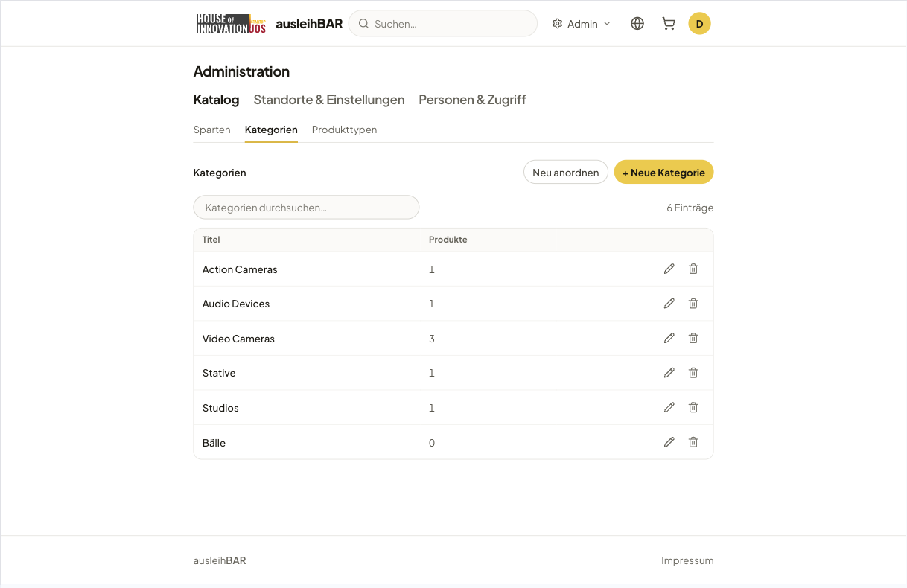
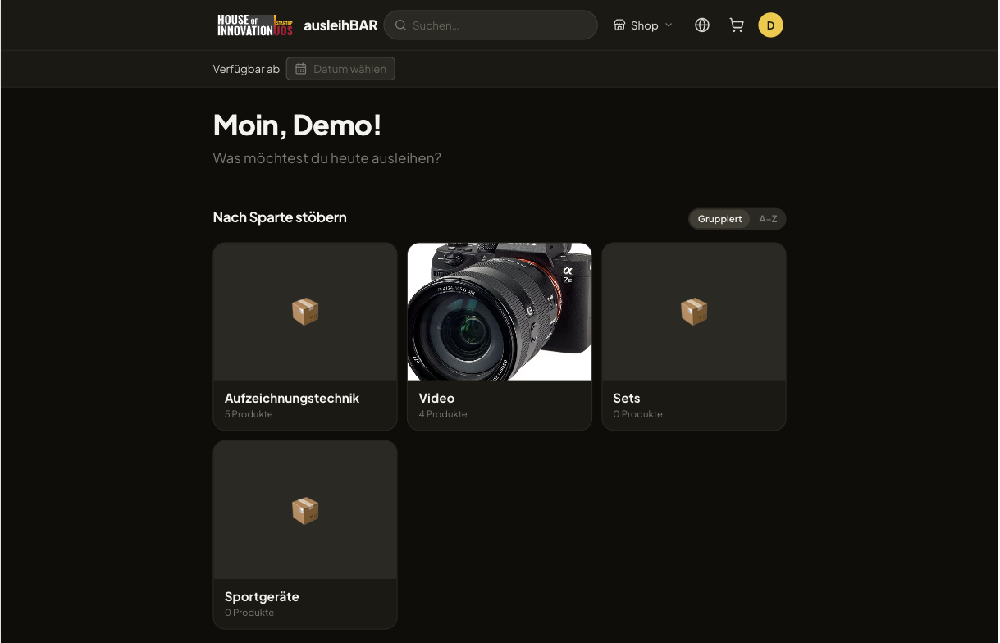
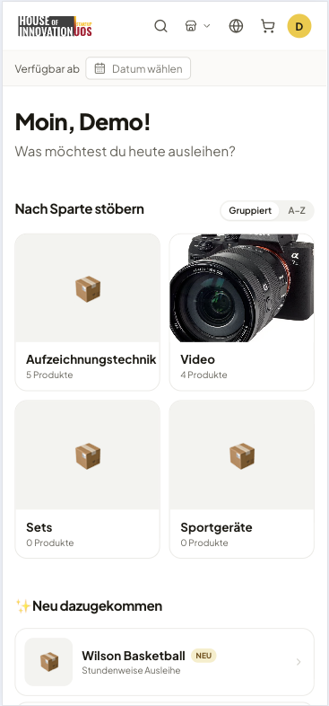

# Ausleihbar — open-source device lending for universities

**Ausleihbar** is an open-source web application for running a university's
**device-lending service**: students and staff browse a catalogue of equipment
(cameras, audio gear, laptops, rooms, …), check availability, reserve, pick up
via QR code and return — while the lending desk and administrators manage
inventory, bookings and the catalogue from the same system.

It is built and used at [**virtUOS**, Universität Osnabrück](https://www.virtuos.uni-osnabrueck.de/)
and released as free software under the **Apache License 2.0**, so other
institutions can run, adapt and contribute to it.

> Replaces aging lending tools and email/paper workflows with a fast,
> mobile-first shop and a focused lending desk — calm, accessible, bilingual
> (German/English).



---

## Highlights

- 🛒 **Borrower shop** — browse by section/category, full-text search,
  availability calendar (per **day** or per **hour**), a cart that holds units
  while you book, reserve, and a personal "My bookings" view.
- 🏷️ **QR pickup & return** — hand out and take back devices by scanning the
  unit's QR code at the desk; printable QR labels in several sheet/label sizes.
- 🗓️ **Lending desk** — day overview, confirm pending reservations, walk-in
  lending, defect handling and re-booking, borrower history and statistics.
- 🧰 **Flexible catalogue** — product **types** with dynamic, schema-driven
  attributes; products, categories and sections with manual ordering; sets of
  items frequently lent together.
- 🌍 **Bilingual content** — every catalogue text is translatable (DE/EN), with
  an optional one-click machine-translation pre-fill via self-hostable
  [LibreTranslate](https://libretranslate.com).
- 🔐 **University SSO** — login via OpenID Connect (Keycloak or your IdP);
  roles for borrowers, lenders (per pool) and admins; access groups and a
  configurable strike/blocking policy.
- 🔁 **Data import/export** — back up or move the whole catalogue (or a single
  pool) — structure, inventory **and images** — as a portable ZIP; plus a
  one-way importer for [leihs](https://github.com/leihs/leihs) inventory.
- 🐙 **GitLab defect tickets** *(optional, per pool)* — automatically open an
  issue when a device is marked defective.
- 🤖 **Optional AI assist** — connect a self-hostable, OpenAI-compatible LLM to
  suggest a product type's attributes and to pre-fill a product from an uploaded
  datasheet PDF; entirely opt-in and off by default.
- ♿ **Accessible & themeable** — keyboard- and screen-reader-friendly, light /
  dark / system appearance.

## Screenshots

| Availability & booking | Schema-driven product types |
| --- | --- |
|  |  |

| Lending desk | Usage statistics |
| --- | --- |
|  |  |

| Catalogue administration | Dark mode |
| --- | --- |
|  |  |

…and fully responsive on the phone:

<p align="center">
  
</p>

> All images live in [`docs/screenshots/`](docs/screenshots/).

## Tech stack

- **Database:** PostgreSQL 16
- **Backend:** Django 5 (Python 3.12) + Django REST Framework — apps
  `accounts`, `catalog`, `lending`, `tenancy`, `common`
- **Frontend:** React 18 + Vite + TypeScript + Tailwind CSS
- **Auth:** OpenID Connect via `mozilla-django-oidc` (Keycloak in local dev)
- **Runtime:** Docker Compose

## Quick start (development)

```bash
# 1. Create your environment file
cp .env.example .env

# 2. Build and start all services
docker compose up --build

# 3. Apply database migrations (in a second terminal)
docker compose exec backend python manage.py migrate

# 4. (optional) Create a local admin user
docker compose exec backend python manage.py createsuperuser
```

Services:

- Frontend: <http://localhost:5173>
- Backend / Django admin: <http://localhost:8000>/admin/
- PostgreSQL: `localhost:5432`

> If host port 8000 is already taken, set `BACKEND_PORT` (and a matching
> `VITE_API_BASE_URL`) in `.env` to publish the backend on another port.

For the full configuration reference (OIDC, email, content language,
scheduled jobs) and a step-by-step **production deployment** guide, see
[`docs/INSTALL.md`](docs/INSTALL.md).

## Domain model

Catalogue models live in [`backend/catalog/models.py`](backend/catalog/models.py),
the booking engine in [`backend/lending/models.py`](backend/lending/models.py),
users and roles in [`backend/accounts/models.py`](backend/accounts/models.py).

- **ProductType** — reusable template with a JSON `attribute_schema` (dynamic
  attributes carrying `visible` / `required` flags).
- **Product** — catalogue entry based on a `ProductType`; title, lending type
  (`hours` / `days`), min/max duration.
- **Resource** — one physical device in exactly one `Product` and one
  `ResourcePool`; status, inventory number, QR-code id.
- **ResourcePool** — a physical location with opening hours and pickup info.
- **Category** / **Section** — group products, and group categories (the
  "Sparten"), both with manual ordering.
- **ProductSet** — items frequently lent together.
- **Booking / BookingItem** — the reservation engine; a `cart`-status booking
  is the shopping cart holding units until checkout.

## Documentation

- [`docs/INSTALL.md`](docs/INSTALL.md) — install, configure and deploy.
- [`docs/concept.md`](docs/concept.md) — the full product concept (features,
  rules, workflows).
- [`docs/decisions/`](docs/decisions/) — Architecture Decision Records (ADRs).
- [`docs/data-transfer.md`](docs/data-transfer.md) — the data import/export
  round-trip.
- [`docs/leihs-import.md`](docs/leihs-import.md) — importing inventory from leihs.
- [`docs/roadmap.md`](docs/roadmap.md) — what's planned.
- [`PRODUCT.md`](PRODUCT.md) & [`DESIGN.md`](DESIGN.md) — product strategy and
  the visual/UX contract.
- [`CLAUDE.md`](CLAUDE.md) — orientation for working in the codebase.

## Contact

Developed and maintained by **virtUOS — Universität Osnabrück**
(<https://www.virtuos.uni-osnabrueck.de/>).

**Contact / maintainer:** Rüdiger Rolf · <rrolf@uni-osnabrueck.de>

Questions, ideas and contributions are welcome — please open an issue or pull
request in this project.

## License

Ausleihbar is licensed under the **Apache License 2.0** — see
[`LICENSE`](LICENSE) and [`NOTICE`](NOTICE). Third-party dependencies and their
licenses are listed in [`THIRD-PARTY-LICENSES.md`](THIRD-PARTY-LICENSES.md);
authors and copyright are recorded in [`AUTHORS.md`](AUTHORS.md).

Copyright 2026 Universität Osnabrück (virtUOS).
